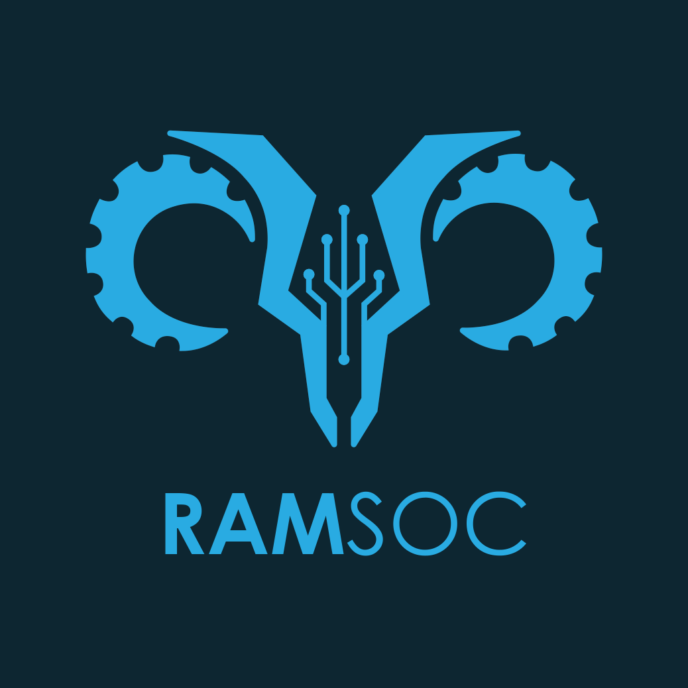

# RAMSoc UNSW Website

The official website for the UNSW Robotics and Mechatronics Society (RAMSoc) - a student-run engineering society that provides Mechatronic Engineering opportunities and pathways between students and the professional community.



## 🚀 Features

- **Modern Tech Stack**: Built with Next.js 15, React 19, and TypeScript
- **Responsive Design**: Optimized for all devices using Tailwind CSS v4
- **Dynamic Content**: Integration with Contentful CMS and Notion API
- **Interactive Components**: Smooth animations with Motion One
- **Career Portal**: Job listings with real-time data from Notion
- **Events System**: Showcase of past and upcoming events
- **Team Showcase**: Dynamic team member profiles by year
- **Type-Safe APIs**: tRPC for end-to-end type safety

## 🛠️ Tech Stack

### Frontend

- **Framework**: Next.js 15 with App Router
- **Language**: TypeScript 5.7
- **Styling**: Tailwind CSS v4 + SCSS modules
- **UI Components**: Radix UI primitives
- **Animations**: Motion One & Framer Motion
- **Icons**: Lucide React
- **Forms**: React Hook Form (planned)

> Using T3 Stack as a base template

### Backend & Data

- **API Layer**: tRPC for type-safe APIs
- **CMS**: Contentful for content management
- **Database**: Notion API for career listings
- **State Management**: TanStack Query (React Query)
- **HTTP Client**: Axios

### Development & Tools

- **Package Manager**: Yarn 1.22+
- **Linting**: ESLint 9 with Next.js config
- **Code Formatting**: Prettier with Tailwind plugin
- **Deployment**: Vercel
- **Build Tool**: Turbopack (Next.js 15)

## ⚙️ Getting Started

Follow these steps to set up the project locally:

1. **Clone the repository**

   ```bash
   git clone https://github.com/UNSW-Robotics-and-Mechatronics-Society/ramsoc-website.git
   cd ramsoc-website
   ```

2. **Install dependencies**

   ```bash
   yarn install
   ```

3. **Set up environment variables**

   Create a `.env.local` file in the root directory:

   ```env
   # Contentful
   CONTENTFUL_SPACE_ID=your_contentful_space_id
   CONTENTFUL_ACCESS_TOKEN=your_contentful_access_token

   # Notion
   NOTION_TOKEN=your_notion_integration_token
   NEXT_PUBLIC_NOTION_CAREERS_DB_ID=your_careers_database_id
   ```

   > Ask the team for the actual values of these environment variables.

4. **Start the development server**

   ```bash
   yarn dev
   ```

   The website will be available at `http://localhost:3000`

## 🏗️ Project Structure

```txt
src/
├── app/                          # Next.js App Router
│   ├── _components/             # Homepage components
│   ├── api/                     # API routes (tRPC, Notion)
│   ├── careers/                 # Career portal with Notion integration
│   ├── events/                  # Events page
│   ├── team/                    # Team showcase by year
│   ├── layout.tsx               # Root layout
│   ├── page.tsx                 # Homepage
│   └── providers.tsx            # React Query & context providers
├── components/                   # Reusable UI components
│   └── ui/                      # Base UI components (Button, Container, etc.)
├── features/                    # Feature-specific components & logic
│   ├── careers/                 # Career-related components & logic
│   └── events/                  # Event-related components & logic
│   └── team/                    # Team-related components & logic
├── hooks/                       # Custom React hooks
├── lib/                         # Utility libraries & helpers
│   ├── contentful/              # Contentful CMS client
│   ├── utils.ts                 # Shared utilities (cn, etc.)
│   └── constants/               # App constants
├── server/                      # Server-side code
│   └── api/                     # tRPC routers & procedures
├── styles/                      # Global styles
│   └── globals.css              # Tailwind imports & global CSS
└── trpc/                        # tRPC client configuration
```

## 🔧 Available Scripts

### Development

- `yarn dev` - Start development server with Turbopack
- `yarn build` - Build for production
- `yarn start` - Start production server
- `yarn lint` - Run ESLint
- `yarn check-types` - Type checking with TypeScript

### Deployment (Vercel)

- `yarn pages:build` - Build for Vercel
- `yarn preview` - Preview Vercel build locally

> Note: Deployment is handled automatically via Vercel on pushes to the `main` branch.

## 📝 Content Management

### Contentful Integration

The website uses Contentful as a headless CMS for managing:

- Event information and details
- Team member profiles and bios
- General content and assets

### Notion Integration

Career listings are managed through Notion databases, providing:

- Easy content management for non-technical users
- Rich text editing with Notion's block editor
- Structured data for job postings
- Real-time updates without redeployment

## 🔌 API Routes

### Standard Next.js Routes

- `/api/events` - Fetch events from Contentful
- `/api/notion/db/[slug]` - Query Notion databases
- `/api/notion/page/[slug]` - Fetch individual Notion pages

### tRPC Endpoints

- `/api/trpc/[trpc]` - Type-safe tRPC API endpoints

## 🎯 Key Features

### Career Portal

- **Interactive Job Listings**: Browse available positions with filtering
- **Modal Overlays**: Detailed job descriptions using Notion rendering
- **Real-time Data**: Direct integration with Notion database
- **Quick Apply**: Direct application links with URL normalization
- **Responsive Design**: Optimized for mobile and desktop
- **Loading States**: Skeleton loaders and React Query caching
- **Keyboard Accessible**: Full keyboard navigation support

### Events System

- **Dynamic Event Cards**: Large and small card variations
- **Loading States**: Skeleton components for smooth UX
- **Past and Current Events**: Automatic separation by date
- **Contentful Integration**: Easy content updates via CMS
- **Image Optimization**: Next.js Image component for performance

### Team Showcase

- **Year-based Navigation**: Browse teams by academic year
- **Profile Cards**: Interactive member profiles with hover effects
- **Subcommittee Organization**: Grouped by role and responsibility
- **Social Links**: LinkedIn and other profile links
- **Responsive Grid**: Adaptive layout for all screen sizes

## 🚀 Deployment

The website is deployed on **Vercel** with automatic deployments from the `main` branch.

### Build Configuration

- **Build command**: `yarn pages:build`
- **Output directory**: `.vercel/output/static`
- **Node version**: 20.x
- **Framework**: Next.js (Static Export)

### Environment Setup

Ensure all required environment variables are set in your Vercel dashboard:

**Required:**

- `CONTENTFUL_SPACE_ID` - Contentful space identifier
- `CONTENTFUL_ACCESS_TOKEN` - Contentful API access token
- `NOTION_TOKEN` - Notion integration token
- `NEXT_PUBLIC_NOTION_CAREERS_DB_ID` - Public Notion database ID for careers

### Deployment Branches

- **Production**: `main` branch → [ramsocunsw.org](https://ramsocunsw.org)
- **Preview**: All other branches get preview deployments

## 🤝 Contributing

We welcome contributions from RAMSoc members and the community!

### Getting Started

1. Fork the repository
2. Create a feature branch (`git checkout -b feat/amazing-feature`)
3. Make your changes
4. Commit your changes (`git commit -m 'feat: add amazing feature'`)
5. Push to the branch (`git push origin feat/amazing-feature`)
6. Open a Pull Request

### Commit Convention

We follow [Conventional Commits](https://www.conventionalcommits.org/):

- `feat:` - New features
- `fix:` - Bug fixes
- `docs:` - Documentation changes
- `style:` - Code style changes (formatting, etc.)
- `refactor:` - Code refactoring
- `test:` - Adding or updating tests
- `chore:` - Maintenance tasks

### Code Style

- Follow existing TypeScript and React patterns
- Use Prettier for code formatting (auto-format on save)
- Ensure ESLint passes before submitting (`yarn lint`)
- Run type checking (`yarn check-types`)
- Write meaningful commit messages
- Keep components focused and reusable
- Use Tailwind CSS utilities over custom CSS when possible
- Convert `@apply` directives to regular CSS in SCSS modules

## 🏛️ Architecture Decisions

### Why Tailwind CSS v4?

- Modern CSS features with `@theme` and custom properties
- Better performance with optimized CSS output
- Improved developer experience with better error messages
- Future-proof with CSS-first approach

### Why No `@apply` in SCSS Modules?

Tailwind v4 requires `@reference` directive for `@apply` in CSS modules, which causes linting issues. We convert `@apply` rules to regular CSS for:

- Better compatibility across tools
- Explicit CSS values (easier to debug)
- No processing overhead
- Consistent with Tailwind v4 best practices

### Why tRPC?

- End-to-end type safety from server to client
- No code generation required
- Automatic TypeScript inference
- Better DX with autocomplete and type errors

### Why React Query?

- Automatic caching and background refetching
- Optimistic updates
- Request deduplication
- Built-in loading and error states
- Great DevTools for debugging

## 📄 License

This project is private and belongs to the UNSW Robotics and Mechatronics Society.

## 📧 Contact

For questions or support:

- **Website**: [ramsocunsw.org](https://ramsocunsw.org)
- **Email**: [technical@ramsocunsw.org](mailto:technical@ramsocunsw.org)
- **GitHub**: [UNSW-Robotics-and-Mechatronics-Society](https://github.com/UNSW-Robotics-and-Mechatronics-Society)

---

Built with ❤️ by the RAMSoc team at UNSW
